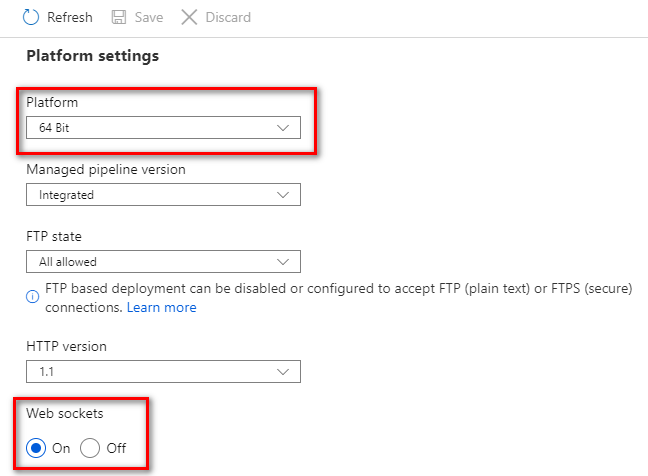

# Remote Debugging Clojure Web Applications on Microsoft Azure Websites

Clojure can be used to build web applications that can be deployed on Microsoft Azure Websites. Developing the application locally is a great deal of fun with the awesome REPL. The repl is also a highly effective mean to observe the live process and troubleshoot tricky issues. However, once it is deployed to Azure, there is no longer an easy way to access a REPL to the live application. This is a small helper to gain that REPL access again. It is quite simple, but highly effective at troubleshooting the live application even in the production environment without any performance hit.

**It doesn't require any kind of addition or modification to your existing clojure web application.**

A simple REPL can be started on a Clojure application just by one simple java option `-Dclojure.server.repl="{:port 9000 :accept clojure.core.server/repl}"`. With this, Clojure would automatically start a *Socket REPL* on port *9000*. The trick is to make this REPL accessible somehow on your local machine. That is the purpose of this tool.

**You can connect it to your IDE using any *Socket REPL* based plugin.**

## Index
* [Prerequisites](#Prerequisites)
* [Ensure 64bit and Enable web-sockets on your azure website](#Ensure-64bit-and-Enable-web-sockets-on-your-azure-website)
* [Enable Socket REPL in web.config](#Enable-Socket-REPL-in-web.config)
* [Gather azure web application connection info](#Gather-azure-web-application-connection-info)
* [Install Clojure CLI](#Install-Clojure-CLI)
* [Add a new alias for this tool to your global *deps.edn* file](#Add-a-new-alias-for-this-tool-to-your-global-deps.edn-file)
* [Access the remote REPL](#Access-the-remote-REPL)
> * [Load and connect](#Load-and-connect)
>> * [Simple quick REPL on terminal](#Simple-quick-REPL-on-terminal)
>> * [Integrate with IDE](#Integrate-with-IDE)
* [How it works](#How-it-works)
* [Limitation](#Limitation)
* [CAUTION](#CAUTION)

## Prerequisites

* Azure website with a Clojure (Java) Web Application.
* Enable websockets on your azure web site.
* Change bitness of your webapp to 64bit.
* Install Clojure CLI

## Ensure 64bit and Enable web-sockets on your azure website



## Enable Socket REPL in web.config

The actual method of hosting Clojure app can be different from the example shown here. In that case, you may have to do it a bit differently to ensure this option in *JAVA_OPTS*.

```xml
<httpPlatform
   processPath="%JAVA_HOME%\bin\java.exe"
   arguments="-Djava.net.preferIPv4Stack=true
              -Dclojure.server.repl=&quot;{:port %HTTP_PLATFORM_DEBUG_PORT% :accept clojure.core.server/repl}&quot;
              -cp d:\home\site\wwwroot\src;d:\home\site\wwwroot\lib\*;d:\home\site\wwwroot\resources
              clojure.main
              -e &quot;(do (require (quote my-app.core)) (my-app.core/start))&quot;">
</httpPlatform>
```

Or

```xml
<httpPlatform>
   <environmentVariables>
      <environmentVariable
         name="JAVA_OPTS"
         value="-Djava.net.preferIPv4Stack=true
                -Dclojure.server.repl=&quot;{:port %HTTP_PLATFORM_DEBUG_PORT% :accept clojure.core.server/repl}&quot;"/>
   </environmentVariables>
</httpPlatform>
```

NOTE: *%HTTP_PLATFORM_DEBUG_PORT%* is a special placeholder which will be replaced with a port internally generated by the *HttpPlatformHandler* module.

Restart your azure website after editing the web.config.

## Gather azure web application connection info

To access the REPL this tool connects to the azure app service scm endpoint and establishes a websocket. It would need the credentials for authentication. You need to obtain those credentials for your azure web application from Azure Portal.

In the Azure Portal, in the *Overview* blade, click *Get publish profile*. This would download a *.PublishSettings* file. Note the *username* and *password* associated with the `MSDeploy` publishMethod.

For convinience, you can use the function `az.ws-debug/parse-publish-settings` available with this tool to parse the *.publishSettings* file. It would return a map which you can pass directly to the `az.ws-debug/connect` function. [see](#Load-and-Connect)

## Install Clojure CLI

Install it from the official site [Clojure.org](https://clojure.org/guides/getting_started "Getting started with Clojure CLI")

## Add a new alias for this tool to your global *deps.edn* file

The global *deps.edn* file is usually located in `.clojure` folder in your `HOME` folder. Typically, on Linux it is `$HOME/.clojure/deps.edn` and on Windows `%USERPROFILE%\.clojure\deps.edn`.

```clojure
  :aliases {
     :az-ws-debug {:extra-deps {az.ws-debug {:git/url "https://github.com/paroda/az-ws-debug"
                                             :sha "075876a5106d5bf73c1dee7e8ae20342437010c7"}}}
  }
```

## Access the remote REPL

Start the tool

```text
> clojure -A:az-ws-debug
Clojure 1.10.1
user=>
```

### Load and connect

#### Simple quick REPL on terminal

To connect call the function `az.ws-debug/connect`. It takes a map with 3 keys:

* `:az-app-name`: the name of your azure webapp. for example, for the web app `https://my-app.azurewebsites.net` the app-name is `my-app`
* `:user-name`: the username as obtained from the PublishSettings for `MSDeploy` publishMethod
* `:password`: the password as obtained from the PublishSettings for `MSDeploy` publishMethod

If you have the *.publishSettings* file ([see](#Gather-azure-web-application-connection-info)), then you can generate this map by calling `(az.ws-debug/parse-publish-settings "/path/to/your-app.publishSettings")`.

Then call `az.ws-debug/repl` to access the remote *Socket REPL*

*TIP*: you can directly pass the path of the *.publishSettings* file to `az.ws-debug/connect` too.

```text
user=> (require '[az.ws-debug :as dbg])
nil
user=> (dbg/connect {:az-app-name "azure-app-name"
                     :user-name "user-name"
                     :password "password"})
20-03-28 17:12:43 localhost INFO [az.ws-debug:17] - session ready
20-03-28 17:12:43 localhost INFO [az.ws-debug:77] - session connected
nil
user=> (dbg/repl)
20-03-28 17:13:56 localhost INFO [az.ws-debug:45] - repl started
=>
```

Now you are connected to the **Socket REPL** on the remote clojure process running on Azure web site. You can interact with it as you would with a locally running REPL. You can dig deeper into the live process on the production environment without disturbing it. For example, you can check the actual environment variables in effect. You can check the state atoms. All sorts of things you are used to while doing local development.

```text
user=> (System/getenv "HTTP_PLATFORM_PORT")
"16408"  ;; quickly check the actual port set by azure web site
user=> (System/getProperty "java.vm.name")
"OpenJDK 64-Bit Server VM"
user=> (System/getProperty "sun.boot.library.path")
"D:\\Program Files\\Java\\zulu8.36.0.1-jre8.0.202-win_x64\\bin"
user=>
```

To close the repl type `:repl/quit`

```text
user=> :repl/quit
20-03-28 17:32:53 localhost INFO [az.ws-debug:53] - repl closed!
nil
user=>
```

To disconnect the websocket type `(az.ws-debug/close)`

```text
user=> (dbg/close)
20-03-28 17:34:50 localhost INFO [az.ws-debug:42] - session closed: 1006 Disconnected
nil
user=>
```

#### Integrate with IDE

There are quite a few options to connect to IDE with *Socket REPL* or *Unrepl* over it.

* [Spiral](https://github.com/Unrepl/spiral) for Emacs
* [Chlorine](https://atom.io/packages/chlorine) for Atom
* [Clover](https://github.com/mauricioszabo/clover/) for VS Code

And ther may be some more, I am just not aware of. If it supports *Socket REPL* then there is a good chance it will just work.

Just as we did above, here too we first connect to Azure, but this time we would specify a local port so that the IDE plugin can connect to it. And this time we would just specify the path to the *.publishSettings* file instead of the map with azure app information. It will automatically parse this file and pickup the credentials for the *publishProfile* where *publishMethod* is `MSDeploy`.

```text
user=> (require '[az.ws-debug :as dbg])
nil
user=> (dbg/connect "path/to/my-app.publishsettings" 3000)
20-04-01 15:14:31 localhost INFO [az.server:109] -
Started Socket REPL server listening on  [127.0.0.1:3000]
 Azure App Name: my-app
 For quick access call  (az.server/repl "my-app")
 Or you can connect from any Socket REPL based client.
nil
user=>
```

It shows that it has started a socket listening on the port we specified `3000`. Now from your IDE just connect to this port.

To close the connection and stop listening on this port, type `(az.ws-debug/close "my-app")` where `my-app` is the name of Azure App Service (also shown in the output of `connect` as shown above).

```text
user=> (dbg/close "my-app")
20-04-01 15:56:58 localhost INFO [az.server:107] - Stopped Socket REPL server: my-app
nil
user=>
```

## How it works

Azure web site provides an option for remote debugging Java application through a websocket connection. However, it assumes that the communication throught this websocket would be [Java Debug Wire Protocol](https://docs.oracle.com/javase/8/docs/technotes/guides/jpda/jdwp-spec.html). And, it checks the first JDWP handshake. However, after that it just passes the raw data as is.

Here, we utilize that websocket connection. To satisfy the initial handshake check, it first sends a 14 byte message "JDWP-Handshake". Otherwise, the remote system would consider it invalid and abort the connection. Once the first handshake is done, the rest is straight forward. Just simple plain text transfer. And so we got the remote Socket REPL on local machine.

## Limitation

It currently tested with *Socket REPL*. However, in principle it should work with PREPL, though not tested yet. It may also be made to work with n-REPL. However, that would need adding extra dependency on server side. Hence that is not the focus here. However, *unrepl* is anohter option which just works over the *Socket REPL*. Thus any tooling based on *unrepl* works just fine.

## CAUTION

You must realize that you are connecting to the live system and be careful with what you do. You would be making changes which would be effective immediately for all.

This is still in alpha stage. There might be issues.
